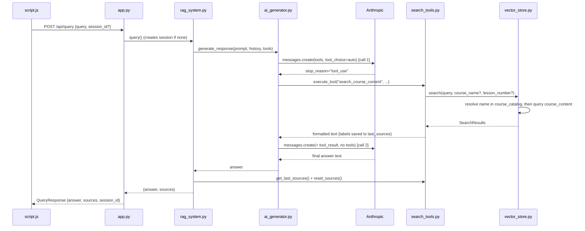

# CLAUDE.md

This file provides guidance to Claude Code (claude.ai/code) when working with code in this repository.

## Commands

```bash
# Install dependencies (Python 3.13+, uv required)
uv sync

# Run the app (serves API + frontend on http://localhost:8000)
./run.sh
# or manually:
cd backend && uv run uvicorn app:app --reload --port 8000
```

A `.env` file in the repo root with `ANTHROPIC_API_KEY=...` is required before the server will answer queries.

There is no test suite, linter, or build step configured. `main.py` at the root is an unused stub — the real entrypoint is `backend/app.py`.

## Architecture

A tool-calling RAG system: Claude decides *whether* to search rather than always retrieving. The flow for a query is:

1. `app.py` (FastAPI) receives `POST /api/query`, ensures a session exists, delegates to `RAGSystem.query()`.
2. `rag_system.py` assembles conversation history + tool definitions and calls `AIGenerator.generate_response()`.
3. `ai_generator.py` calls the Anthropic API with `tool_choice: auto`. If Claude returns `stop_reason == "tool_use"`, it runs the tool via `ToolManager`, appends the result, and makes a **second** API call (without tools) for the final answer. Only one round of tool use is supported.
4. `search_tools.py` `CourseSearchTool.execute()` calls `VectorStore.search()`, formats results with `[Course - Lesson N]` headers, and stashes plain-text source labels on `self.last_sources`.
5. `rag_system.query()` pulls those sources back out via `tool_manager.get_last_sources()`, then calls `reset_sources()`. Sources reach the frontend through the `QueryResponse`, not through the model's text.

See [docs/query-flow.md](docs/query-flow.md) for the full request/response sequence diagram.



### Vector store (`vector_store.py`)

Two ChromaDB collections, both persisted at `backend/chroma_db/`:

- **`course_catalog`** — one document per course (the title), metadata holds instructor, links, and lessons serialized as a `lessons_json` string (ChromaDB metadata can't hold nested objects).
- **`course_content`** — the chunked lesson text, metadata `{course_title, lesson_number, chunk_index}`.

`search()` is two-stage: if a `course_name` filter is given, it's first fuzzy-resolved against `course_catalog` by vector similarity (so "MCP" → the full course title), then that exact title plus optional `lesson_number` become a ChromaDB `where` filter on `course_content`.

The course **title is the primary key** everywhere — collection ID in the catalog, `course_title` foreign key in content chunks, and the dedupe key on ingest.

### Document ingestion (`document_processor.py`)

On startup `app.py` calls `add_course_folder("../docs", clear_existing=False)`. Course docs are plain `.txt` (also `.pdf`/`.docx` accepted) with this header format:

```
Course Title: <title>
Course Link: <url>
Course Instructor: <name>

Lesson 0: <lesson title>
Lesson Link: <url>
<lesson body...>
Lesson 1: ...
```

Text is split into sentence-aware chunks (`CHUNK_SIZE` 800 chars, `CHUNK_OVERLAP` 100, both in `config.py`). Chunks get a context prefix like `Course <title> Lesson <n> content: ...` prepended before embedding. Ingest skips any course whose title already exists in the catalog — **to re-index changed content you must delete `backend/chroma_db/`** or call `add_course_folder(clear_existing=True)`.

### Sessions (`session_manager.py`)

In-memory only (`dict`, lost on restart). IDs are sequential (`session_1`, ...). History is trimmed to `MAX_HISTORY` (2) exchanges and passed to the model as a formatted string appended to the system prompt, not as real message turns.

### Config (`config.py`)

All tunables (model ID `claude-sonnet-5`, embedding model `all-MiniLM-L6-v2`, chunk sizes, `MAX_RESULTS` 5, `CHROMA_PATH`) live in the `Config` dataclass. Paths in `config.py` and `app.py` are relative and assume the process runs from `backend/`.

Note: `ai_generator.py` deliberately omits the `temperature` param — current models (Sonnet 5+) reject it.

### Frontend (`frontend/`)

Static `index.html` + `script.js`, served by FastAPI at `/`. No framework/build — `marked.js` renders markdown answers. `DevStaticFiles` in `app.py` forces no-cache headers so edits show up on reload.

## Adding a new tool

Implement the `Tool` ABC in `search_tools.py` (`get_tool_definition()` returning an Anthropic tool schema + `execute()`), then register it in `RAGSystem.__init__` via `self.tool_manager.register_tool(...)`. If it produces UI sources, expose a `last_sources` attribute — `ToolManager.get_last_sources()` scans all tools for it.
