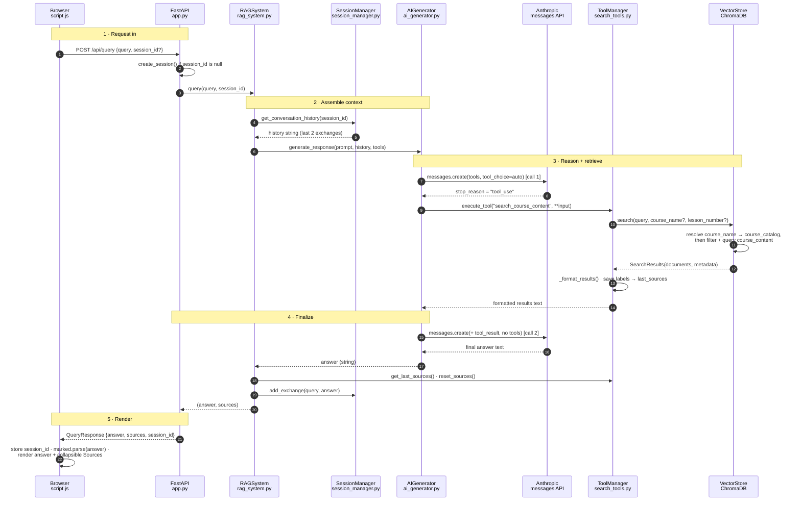

# Query flow: browser → backend → browser

How a single question typed in the web UI becomes an answer. It crosses seven
components, triggers **two** separate Anthropic API calls and one vector search,
and returns citations that are assembled *outside* the model's text.

## Step by step

1. **Browser** — [`script.js`](../frontend/script.js) `sendMessage()` reads the input,
   disables the form, shows a loading indicator, and `fetch`es
   `POST /api/query` with `{query, session_id}`. On the first message
   `session_id` is `null`.
2. **FastAPI** — [`app.py`](../backend/app.py) `query_documents()` creates a session
   if none was sent, then calls `rag_system.query()`.
3. **Orchestrator** — [`rag_system.py`](../backend/rag_system.py) `query()` wraps the
   question in a prompt, fetches conversation history from `SessionManager`
   (in-memory, trimmed to `MAX_HISTORY` = 2 exchanges), and calls
   `AIGenerator.generate_response()` with the tool definitions.
4. **First Anthropic call** — [`ai_generator.py`](../backend/ai_generator.py) sends the
   system prompt + history + `tools` with `tool_choice: auto`. Claude decides
   whether to search. **General-knowledge questions return text here** and skip
   straight to step 8.
5. **Tool execution** — if `stop_reason == "tool_use"`,
   `_handle_tool_execution()` loops the tool-use blocks and calls
   `tool_manager.execute_tool()` → `CourseSearchTool.execute()` in
   [`search_tools.py`](../backend/search_tools.py).
6. **Vector search** — [`vector_store.py`](../backend/vector_store.py) `search()`
   optionally fuzzy-resolves a `course_name` against the `course_catalog`
   collection, builds a ChromaDB `where` filter, and queries `course_content`.
   `_format_results()` adds `[Course - Lesson N]` headers and stores plain-text
   source labels on `self.last_sources`.
7. **Second Anthropic call** — `ai_generator.py` resends the conversation with
   the tool result appended and **no tools**, producing the final answer.
   Only one tool round is supported — `_handle_tool_execution` does not loop.
8. **Back through the orchestrator** — `rag_system.query()` pulls `last_sources`
   out of the tool manager, resets them, records the exchange in the session,
   and returns `(answer, sources)`.
9. **Response** — `app.py` packages `QueryResponse {answer, sources, session_id}`.
   Sources travel as a separate field, not inside the model's text.
10. **Browser render** — `script.js` stores the returned `session_id` for
    continuity, removes the loading indicator, renders `answer` through
    `marked.parse()`, and shows `sources` in a collapsible `
` block.

## Three things that make this flow unusual

- **Two model calls, not one.** The first call only decides *what* to search for;
  the second writes the answer from what came back.
- **One tool round, by construction.** `_handle_tool_execution` runs the tools
  once and then calls the model without tools — Claude cannot chain a second
  search off the first result without a code change.
- **Sources ride alongside the answer.** `CourseSearchTool` writes labels to
  `last_sources`; `RAGSystem` reads them after the model finishes and puts them
  in the response payload, so citations stay exact.
